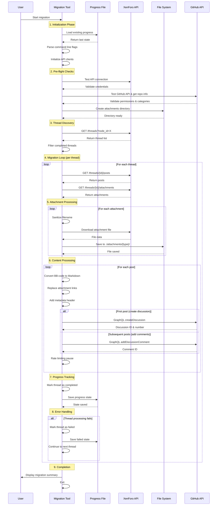

# Migration Tool Architecture

This document provides a detailed technical overview of how the XenForo to GitHub Discussions migration tool works.

## How It Works

The migration tool follows a systematic process to safely transfer forum content from XenForo to GitHub Discussions:



## Process Breakdown

### 1. **Initialization Phase**
- Loads existing progress from `migration_progress.json`
- Parses command-line flags (`--dry-run`, `--verbose`, `--resume-from`)
- Initializes XenForo REST and GitHub GraphQL clients

### 2. **Pre-flight Checks**
- **XenForo API**: Validates credentials and API access
- **GitHub API**: Confirms repository access, Discussions enabled, and category mappings
- **File System**: Creates attachment directories with proper permissions

### 3. **Thread Discovery**
- Fetches all threads from specified XenForo node
- Filters out already completed threads based on progress file
- Continues from `--resume-from` point if specified

### 4. **Migration Processing** (per thread)
- **Posts**: Retrieves all posts for the thread
- **Attachments**: Downloads associated files
- **Content Conversion**: BB-code → Markdown transformation
- **Discussion Creation**: First post becomes GitHub Discussion
- **Comment Addition**: Subsequent posts become comments

### 5. **Content Transformation Pipeline**
```
XenForo BB-code → Sanitize → Convert Formatting → Preserve Links → Add Metadata → GitHub Markdown
```

### 6. **Error Handling & Recovery**
- **Thread-level failures**: Mark as failed, continue with next thread
- **Rate limiting**: Automatic exponential backoff
- **Progress corruption**: Fallback to clean state
- **API errors**: Retry logic with configurable attempts

### 7. **Safety Features**
- **Dry-run mode**: Preview changes without making API calls
- **Progress persistence**: Resume interrupted migrations
- **Filename sanitization**: Prevent path traversal attacks
- **Atomic operations**: Thread completion is all-or-nothing

## Key Design Principles

1. **Resumable**: Migration can be interrupted and resumed safely
2. **Defensive**: Comprehensive error handling and validation
3. **Transparent**: Detailed logging and progress tracking
4. **Secure**: Input sanitization and safe file operations
5. **Rate-limit aware**: Respects API limitations automatically

## Technical Implementation Details

### BB-Code to Markdown Conversion

The tool implements a sophisticated BB-code parser that:

- **Preserves markdown links**: Uses negative lookahead regex to avoid converting `[text](url)` patterns
- **Handles empty tags**: Removes empty formatting tags like `[b][/b]` entirely
- **Processes nested structures**: Correctly handles quotes, code blocks, and lists
- **Sanitizes content**: Removes or converts unsupported formatting

### Security Measures

- **Filename sanitization**: Uses `filepath.IsLocal()` and character filtering to prevent path traversal
- **Input validation**: All user inputs are validated before processing
- **API authentication**: Secure token-based authentication for both platforms
- **Progress corruption handling**: Detects and recovers from corrupted progress files

### Performance Optimizations

- **Rate limiting compliance**: Automatic exponential backoff for API limits
- **Concurrent safety**: Thread-safe progress tracking and file operations
- **Memory management**: Streaming file downloads for large attachments
- **Progress checkpointing**: Regular progress saves to minimize data loss

### Error Recovery

The tool implements multiple layers of error recovery:

1. **Request-level**: Retry with exponential backoff for transient failures
2. **Thread-level**: Mark individual threads as failed and continue
3. **Progress-level**: Detect corrupted progress and fall back to clean state
4. **Session-level**: Allow migration resumption from any point

## Data Structures

### Progress Tracking
```go
type MigrationProgress struct {
    LastThreadID     int   `json:"last_thread_id"`
    CompletedThreads []int `json:"completed_threads"`
    FailedThreads    []int `json:"failed_threads"`
    LastUpdated      int64 `json:"last_updated"`
}
```

### XenForo API Models
```go
type XenForoThread struct {
    ThreadID    int    `json:"thread_id"`
    Title       string `json:"title"`
    NodeID      int    `json:"node_id"`
    Username    string `json:"username"`
    PostDate    int64  `json:"post_date"`
    FirstPostID int    `json:"first_post_id"`
}

type XenForoPost struct {
    PostID   int    `json:"post_id"`
    ThreadID int    `json:"thread_id"`
    Username string `json:"username"`
    PostDate int64  `json:"post_date"`
    Message  string `json:"message"`
}

type XenForoAttachment struct {
    AttachmentID int    `json:"attachment_id"`
    Filename     string `json:"filename"`
    ViewURL      string `json:"view_url"`
}
```

## Configuration

### Node to Category Mapping
The tool uses a static mapping to convert XenForo forum nodes to GitHub Discussion categories:

```go
var NodeToCategory = map[int]string{
    1: "DIC_kwDOxxxxxxxx", // General Discussion
    2: "DIC_kwDOyyyyyyyy", // Q&A
    3: "DIC_kwDOzzzzzzzz", // Announcements
}
```

### API Configuration
```go
var (
    XenForoAPIURL  = "https://your-forum.com/api"
    XenForoAPIKey  = "your_xenforo_api_key"
    XenForoAPIUser = "1"
    GitHubToken    = "your_github_token"
    GitHubRepo     = "owner/repository"
    TargetNodeID   = 1
    MaxRetries     = 3
)
```

## Testing Strategy

The codebase includes comprehensive tests covering:

- **Unit tests**: Individual function behavior
- **Integration tests**: API interaction patterns
- **Error handling tests**: Failure scenarios and recovery
- **Security tests**: Path traversal and input validation
- **Performance tests**: Benchmarks for critical paths

## Deployment Considerations

### Resource Requirements
- **Memory**: Scales with forum size, typically 100-500MB
- **Storage**: Space for downloaded attachments
- **Network**: Dependent on API rate limits and attachment sizes

### Monitoring
- **Progress logs**: Track migration status and performance
- **Error logs**: Detailed failure information for debugging
- **Rate limit logs**: API usage and throttling information

### Scaling
For large forums, consider:
- **Batch processing**: Migrate specific node ranges
- **Parallel instances**: Multiple tools with different node mappings
- **Resource monitoring**: Watch memory and storage usage
