# Migration Tool Architecture

This document provides a detailed technical overview of how the XenForo to GitHub Discussions migration tool works.

## Project Structure

Following Go best practices with the updated module layout:

```text
cmd/                            # Command entry points
└── xenforo-to-gh-discussions/  # Application entry point (30 lines, complexity ~2)
    └── main.go

internal/                       # Private application packages
├── config/                     # Configuration management
│   ├── config.go              # Config struct and initialization  
│   ├── interactive.go         # Interactive prompts and validation
│   ├── validation.go          # Configuration validation logic
│   └── config_test.go         # Unit tests
├── xenforo/                   # XenForo API operations
│   ├── models.go              # Data structures for API responses
│   ├── client.go              # HTTP client with retry logic
│   ├── api.go                 # API method implementations
│   └── xenforo_test.go        # Unit tests
├── github/                    # GitHub API operations
│   ├── client.go              # GraphQL client initialization
│   ├── queries.go             # GraphQL queries (repository info)
│   ├── mutations.go           # GraphQL mutations (create discussion/comment)
│   └── github_test.go         # Unit tests
├── bbcode/                    # BB-code to Markdown conversion
│   ├── converter.go           # Core conversion logic
│   ├── processor.go           # Message processing and formatting
│   └── bbcode_test.go         # Unit tests
├── attachments/               # File handling and security
│   ├── sanitizer.go           # Filename sanitization and path validation
│   ├── downloader.go          # File download and link replacement
│   ├── attachment_test.go     # Unit tests
│   └── test_attachments/      # Test attachment files
│       └── png/
├── progress/                  # Migration progress tracking
│   ├── tracker.go             # Progress tracking logic
│   ├── persistence.go         # JSON serialization and file I/O
│   └── progress_test.go       # Unit tests
├── migration/                 # Migration orchestration
│   ├── migrator.go            # Main migration coordinator
│   ├── interactive.go         # Interactive migration workflow
│   ├── preflight.go           # Pre-flight validation checks
│   ├── runner.go              # Migration execution logic
│   └── migration_test.go      # Unit tests
└── testutil/                  # Shared test utilities
    ├── github_mock.go         # GitHub API mocks
    └── xenforo_mock.go        # XenForo API mocks

test/                          # Test organization following Go best practices  
├── integration/               # Integration and end-to-end tests
│   └── migration_test.go
└── testdata/                  # Test data and fixtures
    └── sample_bbcode.txt
```

## How It Works

> [!TIP]
> The migration tool follows a systematic process to safely transfer forum content from XenForo to GitHub Discussions with interactive configuration and error handling:

```mermaid
sequenceDiagram
    participant User
    participant Interactive as "Interactive Config"
    participant App as "Migration Tool"
    participant Progress as "Progress File"
    participant XF as "XenForo API"
    participant FS as "File System"
    participant GH as "GitHub API"

    User->>App: Start migration
    
    Note over App,Interactive: 1. Interactive Configuration Phase
    App->>Interactive: Check --non-interactive flag
    alt Interactive Mode (Default)
        Interactive->>User: Prompt for XenForo API URL
        User-->>Interactive: Provide credentials
        Interactive->>XF: Validate credentials immediately
        XF-->>Interactive: Return available categories with counts
        Interactive->>User: Show XenForo categories list
        User-->>Interactive: Select source category
        
        Interactive->>User: Prompt for GitHub token & repository
        User-->>Interactive: Provide GitHub credentials
        Interactive->>GH: Validate GitHub permissions
        GH-->>Interactive: Return available discussion categories
        Interactive->>User: Show GitHub categories list
        User-->>Interactive: Select target category
        
        Interactive->>User: Offer dry-run preview?
        alt User chooses dry-run
            Interactive->>XF: GET dry-run statistics
            XF-->>Interactive: Thread/post/attachment counts
            Interactive->>User: Display migration preview table
            Interactive->>User: Proceed with actual migration?
            User-->>Interactive: Confirm or abort
        end
    else Non-Interactive Mode
        App->>App: Load from environment variables
    end
    
    Note over App: 2. Migration Initialization
    App->>Progress: Load existing progress per category
    Progress-->>App: Return last state
    App->>App: Parse command line flags
    App->>App: Initialize API clients
    
    Note over App: 3. Continuous Migration Loop
    loop For each category pair (until user says stop)
        Note over App: 4. Single Category Migration
        App->>FS: Create category-specific attachments directory
        FS-->>App: Directory ready
        
        App->>XF: GET /threads?node_id=selected_category
        XF-->>App: Return thread list
        App->>App: Filter completed threads from progress
        
        Note over App: 5. Thread Processing Loop
        loop For each thread
            App->>XF: GET /threads/{id}/posts
            XF-->>App: Return posts
            App->>XF: GET /threads/{id}/attachments
            XF-->>App: Return attachments
            
            Note over App: 6. Attachment Processing
            loop For each attachment
                App->>App: Sanitize filename
                App->>XF: Download attachment file
                XF-->>App: File data
                App->>FS: Save to ./attachments/{type}/
                FS-->>App: File saved
            end
            
            Note over App: 7. Content Processing
            loop For each post
                App->>App: Convert BB-code to Markdown
                App->>App: Replace attachment links
                App->>App: Add metadata header
                
                alt First post (create discussion)
                    App->>GH: GraphQL createDiscussion
                    GH-->>App: Discussion ID & number
                else Subsequent posts (add comments)
                    App->>GH: GraphQL addDiscussionComment
                    GH-->>App: Comment ID
                end
                
                App->>App: Rate limiting pause
            end
            
            Note over App: 8. Progress Tracking
            App->>App: Mark thread as completed
            App->>Progress: Save progress state per category
            Progress-->>App: State saved
            
            Note over App: 9. Interactive Error Handling
            alt Thread processing fails
                App->>User: Show error with retry/skip/abort options
                User-->>App: Choose action (retry/skip/abort)
                alt User chooses skip
                    App->>App: Mark thread as failed, resume from next
                    App->>Progress: Save skip state
                else User chooses abort
                    App->>User: Show resume command with --resume-from
                    App->>App: Exit with saved progress
                end
            end
        end
        
        Note over App: 10. Category Completion
        App->>User: Migration complete! Migrate another category?
        User-->>App: Yes/No response
        alt User wants to continue
            App->>Interactive: Select new category pair
            Interactive->>XF: Fetch categories (mark migrated ones)
            Interactive->>User: Show updated category list
            User-->>Interactive: Select next source & target
        else User finished
            App->>User: Display final migration summary
            App->>App: Exit
        end
    end
```



## Process Breakdown

> [!IMPORTANT]
> The new interactive workflow significantly improves user experience:

### 1. **Interactive Configuration Phase**
> [!TIP]
> **Interactive Mode (Default)**:
> - Prompts for XenForo API credentials and validates them immediately
> - Shows available forum categories with thread counts
> - Prompts for GitHub token and repository, validates permissions
> - Displays GitHub Discussion categories for selection
> - Offers a dry-run preview with migration statistics

> [!NOTE]
> **Non-Interactive Mode**: Uses environment variables for automation scenarios

### 2. **Migration Initialization**
- Loads existing progress from category-specific files (`migration_progress_nodeX.json`)
- Parses command-line flags (`--dry-run`, `--verbose`, `--resume-from`, `--non-interactive`)
- Initializes XenForo REST and GitHub GraphQL clients

### 3. **Continuous Migration Loop**
> [!TIP]
> The tool now supports migrating multiple categories in sequence, asking after each completion if you want to continue with another category.

### 4. **Single Category Migration**
- Creates category-specific attachment directories
- Fetches threads from the selected XenForo category
- Filters completed threads based on a progress file
- Processes each thread individually

### 5. **Thread Processing**
- **Posts**: Retrieves all posts for the thread
- **Attachments**: Downloads associated files
- **Content Conversion**: BB-code → Markdown transformation
- **Discussion Creation**: First post becomes GitHub Discussion
- **Comment Addition**: Subsequent posts become comments

### 6. **Content Transformation Pipeline**
```text
XenForo BB-code → Sanitize → Convert Formatting → Preserve Links → Add Metadata → GitHub Markdown
```

### 7. **Interactive Error Handling**
> [!IMPORTANT]
> Enhanced error handling with user interaction:
> - **Interactive prompts**: When errors occur, the user can choose retry/skip/abort
> - **Skip functionality**: Mark the thread as failed and continue from next thread ID
> - **Progress preservation**: All progress saved before exiting
> - **Resume guidance**: Shows exact command to resume with `--resume-from`

### 8. **Safety Features**
> [!WARNING]
> Critical safety measures:
> - **Dry-run mode**: Preview changes without making API calls
> - **Progress persistence**: Resume interrupted migrations safely
> - **Filename sanitization**: Prevent path traversal attacks
> - **Atomic operations**: Thread completion is all-or-nothing

## Key Design Principles

1. **Resumable**: Migration can be interrupted and resumed safely
2. **Defensive**: Comprehensive error handling and validation
3. **Transparent**: Detailed logging and progress tracking
4. **Secure**: Input sanitization and safe file operations
5. **Rate-limit aware**: Respects API limitations automatically

## Technical Implementation Details

### BB-Code to Markdown Conversion

The tool implements a sophisticated BB-code parser that:

- **Preserves Markdown links**: Uses negative lookahead regex to avoid converting `[text](url)` patterns
- **Handles empty tags**: Removes empty formatting tags like `[b][/b]` entirely
- **Processes nested structures**: Correctly handles quotes, code blocks, and lists
- **Sanitizes content**: Removes or converts unsupported formatting

### Security Measures

> [!WARNING]
> Security is paramount in this migration tool:
> - **Filename sanitization**: Uses `filepath.IsLocal()` and character filtering to prevent path traversal
> - **Input validation**: All user inputs are validated before processing
> - **API authentication**: Secure token-based authentication for both platforms
> - **Progress corruption handling**: Detects and recovers from corrupted progress files

### Performance Optimizations

- **Rate limiting compliance**: Automatic exponential backoff for API limits
- **Concurrent safety**: Thread-safe progress tracking and file operations
- **Memory management**: Streaming file downloads for large attachments
- **Progress checkpointing**: Regular progress saves to minimize data loss

### Error Recovery

The tool implements multiple layers of error recovery:

1. **Request-level**: Retry with exponential backoff for transient failures
2. **Thread-level**: Mark individual threads as failed and continue
3. **Progress-level**: Detect corrupted progress and fall back to a clean state
4. **Session-level**: Allow migration resumption from any point

## Data Structures

### Progress Tracking
```go
type MigrationProgress struct {
    LastThreadID     int   `json:"last_thread_id"`
    CompletedThreads []int `json:"completed_threads"`
    FailedThreads    []int `json:"failed_threads"`
    LastUpdated      int64 `json:"last_updated"`
}
```

### XenForo API Models
```go
type XenForoThread struct {
    ThreadID    int    `json:"thread_id"`
    Title       string `json:"title"`
    NodeID      int    `json:"node_id"`
    Username    string `json:"username"`
    PostDate    int64  `json:"post_date"`
    FirstPostID int    `json:"first_post_id"`
}

type XenForoPost struct {
    PostID   int    `json:"post_id"`
    ThreadID int    `json:"thread_id"`
    Username string `json:"username"`
    PostDate int64  `json:"post_date"`
    Message  string `json:"message"`
}

type XenForoAttachment struct {
    AttachmentID int    `json:"attachment_id"`
    Filename     string `json:"filename"`
    ViewURL      string `json:"view_url"`
}
```

## Configuration

> [!IMPORTANT]
> Configuration has been completely redesigned for the interactive workflow:

### Interactive Configuration
> [!TIP]
> **Default Mode**: The tool now prompts for all configurations interactively:
> - XenForo API credentials with immediate validation
> - Real-time category discovery and selection
> - GitHub token validation and repository verification
> - Category mapping through user selection (no static mapping needed!)

### Environment Variables (Automation)
> [!NOTE]
> For automated deployments, use environment variables with `--non-interactive`:

```bash
# XenForo Configuration
export XENFORO_API_URL="https://your-forum.com/api"
export XENFORO_API_KEY="your_xenforo_api_key"
export XENFORO_API_USER="1"
export XENFORO_NODE_ID="42" # XenForo category/node ID to migrate from

# GitHub Configuration
export GITHUB_TOKEN="your_github_token"
export GITHUB_REPO="owner/repository"
export GITHUB_CATEGORY_ID="DIC_kwDOxxxxxxxx" # GitHub Discussion category ID to migrate to

# Migration Settings
export MAX_RETRIES="3"
export ATTACHMENTS_DIR="./attachments"
export PROGRESS_FILE="migration_progress.json" # Optional: custom progress file path
export ATTACHMENT_RATE_LIMIT_DELAY="500ms" # Optional: delay between downloads
```

### Dynamic Category Selection
> [!TIP]
> No more static mapping! The tool dynamically:
> - Fetches available XenForo categories with thread counts
> - Shows GitHub Discussion categories with descriptions
> - Allows one-at-a-time category pair selection
> - Marks previously migrated categories

## Testing Strategy

> [!NOTE]
> Following Go best practices, tests are now organized alongside source code:

### Test Organization
> [!TIP]
> **Unit tests**: Located with source code (`internal/*/`*`_test.go`)
> - Direct access to package internals
> - Better IDE integration and discovery
> - Simpler import paths

> [!IMPORTANT]
> **Integration tests**: Centralized in `test/integration/`
> - End-to-end migration workflows
> - Mock-based full pipeline testing
> - Real API interaction patterns

### Test Coverage Areas
- **Unit tests**: Individual function behavior and edge cases
- **Integration tests**: Complete migration workflows
- **Error handling tests**: Interactive error scenarios and recovery
- **Security tests**: Path traversal prevention and input validation
- **Performance tests**: Benchmarks for critical migration paths

## Deployment Considerations

> [!CAUTION]
> Consider these factors for large-scale migrations:

### Resource Requirements
- **Memory**: Scales with forum size, typically 100–500MB
- **Storage**: Space for downloaded attachments (can be significant)
- **Network**: Dependent on API rate limits and attachment sizes

### Monitoring
> [!TIP]
> Enhanced logging provides detailed insights:
> - **Progress logs**: Track migration status and performance per category
> - **Error logs**: Detailed failure information with interactive context
> - **Rate limit logs**: API usage and throttling information
> - **Interactive session logs**: User choices and workflow decisions

### Scaling Strategies
> [!IMPORTANT]
> For large forums with many categories:
> - **Interactive workflow**: Naturally batches by category
> - **Category-specific progress**: Each category tracks progress independently
> - **Resource monitoring**: Watch memory and storage usage per category
> - **Resume capability**: Interrupt and resume at any point
