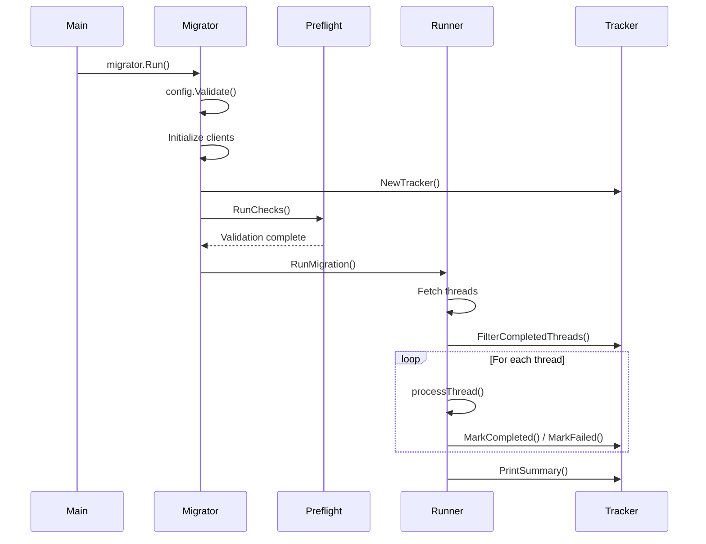

# Migration Tool Architecture

This document provides a detailed technical overview of the refactored XenForo to GitHub Discussions migration tool.

## Architecture Overview

The migration tool has been completely refactored to follow clean architecture principles with well-separated concerns, improved testability, and reduced cyclomatic complexity.

### Package Structure

```
main.go                          # Application entry point (30 lines, complexity ~2)

internal/                        # Private application packages
├── config/                      # Configuration management
│   ├── config.go               # Config struct and initialization
│   └── validation.go           # Configuration validation logic
├── xenforo/                    # XenForo API operations
│   ├── models.go               # Data structures for API responses
│   ├── client.go               # HTTP client with retry logic
│   └── api.go                  # API method implementations
├── github/                     # GitHub API operations
│   ├── client.go               # GraphQL client initialization
│   ├── queries.go              # GraphQL queries (repository info)
│   └── mutations.go            # GraphQL mutations (create discussion/comment)
├── bbcode/                     # BB-code to Markdown conversion
│   ├── converter.go            # Core conversion logic
│   └── processor.go            # Message processing and formatting
├── attachments/                # File handling and security
│   ├── sanitizer.go            # Filename sanitization and path validation
│   └── downloader.go           # File download and link replacement
├── progress/                   # Migration progress tracking
│   ├── tracker.go              # Progress tracking logic
│   └── persistence.go          # JSON serialization and file I/O
└── migration/                  # Migration orchestration
    ├── migrator.go             # Main migration coordinator
    ├── preflight.go            # Pre-flight validation checks
    └── runner.go               # Migration execution logic

test/                           # Test organization following Go best practices
├── unit/                       # Unit tests for individual packages
│   ├── bbcode_test.go
│   ├── attachment_test.go
│   ├── progress_test.go
│   └── config_test.go
├── integration/                # Integration and end-to-end tests
│   └── migration_test.go
├── mocks/                      # Mock implementations for testing
│   ├── github_mock.go
│   └── xenforo_mock.go
└── testdata/                   # Test data and fixtures
    ├── sample_responses/
    └── fixtures/
```

## Architectural Improvements

### 1. Reduced Cyclomatic Complexity

**Before**: 
- `main()` function: 134 lines, complexity 21
- `TestEndToEndMigration()`: complexity 20

**After**:
- `main()` function: 31 lines, complexity ~2
- All functions kept below complexity 15
- Logic distributed across focused, single-responsibility functions

### 2. Separation of Concerns

Each package has a clear, single responsibility:

- **config**: Configuration management with environment variable support
- **xenforo**: XenForo API client with retry logic and error handling  
- **github**: GitHub GraphQL operations with proper error handling
- **bbcode**: BB-code to Markdown conversion with comprehensive support
- **attachments**: Secure file handling with path traversal protection
- **progress**: Migration progress tracking with atomic operations
- **migration**: High-level orchestration tying everything together

### 3. Dependency Injection

The new architecture supports dependency injection, making it highly testable:

```go
type Runner struct {
    config         *config.Config
    xenforoClient  *xenforo.Client
    githubClient   *github.Client
    tracker        *progress.Tracker
    downloader     *attachments.Downloader
    processor      *bbcode.MessageProcessor
}
```

### 4. Configuration Management

Enhanced configuration with environment variable support:

```go
type Config struct {
    XenForo    XenForoConfig
    GitHub     GitHubConfig
    Migration  MigrationConfig
    Filesystem FilesystemConfig
}

// Supports both env vars and defaults
func getEnvOrDefault(key, defaultValue string) string
```

## Migration Flow

The migration process follows a clean, step-by-step approach:



## Key Design Patterns

### 1. Strategy Pattern
- **BB-code Conversion**: Pluggable conversion strategies
- **File Handling**: Different strategies for different file types

### 2. Repository Pattern
- **Progress Persistence**: Abstracts storage mechanism
- **Configuration**: Abstracts configuration sources

### 3. Adapter Pattern
- **API Clients**: Adapts external APIs to internal interfaces
- **Mock Implementations**: Adapts real clients for testing

### 4. Command Pattern
- **Migration Operations**: Each operation encapsulated as command
- **Retry Logic**: Commands can be retried with backoff

## Error Handling Strategy

### 1. Layered Error Handling
```go
// Package-level errors
var (
    ErrInvalidConfig = errors.New("invalid configuration")
    ErrAPIFailure    = errors.New("API call failed")
)

// Context-aware wrapping
return fmt.Errorf("failed to create discussion: %w", err)
```

### 2. Graceful Degradation
- **Thread-level failures**: Mark as failed, continue with next
- **Attachment failures**: Log warning, continue without attachments
- **Rate limiting**: Automatic exponential backoff

### 3. Recovery Strategies
- **Progress corruption**: Fall back to clean state
- **Network failures**: Retry with backoff
- **Partial failures**: Resume from last successful point

## Security Enhancements

### 1. Path Traversal Protection
```go
func (s *FileSanitizer) ValidatePath(filePath, baseDir string) error {
    // Comprehensive path validation
    absDir, _ := filepath.Abs(baseDir)
    absFilePath, _ := filepath.Abs(filePath)
    
    if !strings.HasPrefix(absFilePath, absDir+string(filepath.Separator)) {
        return filepath.ErrBadPattern
    }
    return nil
}
```

### 2. Input Sanitization
- **Filename sanitization**: Remove unsafe characters
- **BB-code processing**: Prevent injection attacks
- **Configuration validation**: Validate all inputs before use

### 3. Credential Management
- **Environment variables**: Secure credential storage
- **No hardcoded secrets**: All secrets externalized
- **Validation**: Ensure credentials are properly formatted

## Testing Strategy

### 1. Unit Tests
- **Individual package testing**: Each package has comprehensive unit tests
- **Mock dependencies**: Clean interfaces enable easy mocking
- **Edge cases**: Comprehensive coverage of error conditions

### 2. Integration Tests
- **API interaction**: Test real API integration patterns
- **End-to-end flows**: Validate complete migration scenarios
- **Performance testing**: Ensure scalability

### 3. Test Organization
```
test/
├── unit/           # Fast, isolated tests
├── integration/    # Slower, system tests
├── mocks/         # Reusable mock implementations
└── testdata/      # Test fixtures and data
```

## Performance Optimizations

### 1. Efficient Memory Usage
- **Streaming**: Process large files without loading entirely in memory
- **Batch processing**: Handle large datasets efficiently
- **Resource cleanup**: Proper cleanup of resources

### 2. Concurrent Safety
- **Thread-safe operations**: Safe concurrent access to shared resources
- **Atomic operations**: Progress updates are atomic
- **Race condition prevention**: Careful synchronization

### 3. Rate Limiting Compliance
- **Exponential backoff**: Smart retry strategy
- **Request throttling**: Respect API rate limits
- **Monitoring**: Track API usage patterns

## Configuration Examples

### Environment Variables
```bash
export XENFORO_API_URL="https://forum.example.com/api"
export XENFORO_API_KEY="your_api_key"
export GITHUB_TOKEN="ghp_your_token"
export GITHUB_REPO="owner/repository"
```

### Programmatic Configuration
```go
cfg := &config.Config{
    XenForo: config.XenForoConfig{
        APIURL: "https://forum.example.com/api",
        APIKey: "your_api_key",
        NodeID: 1,
    },
    GitHub: config.GitHubConfig{
        Token: "ghp_your_token",
        Repository: "owner/repository",
        Categories: map[int]string{
            1: "DIC_kwDOxxxxxxxx",
        },
    },
}
```

## Extensibility

The new architecture makes it easy to extend functionality:

### 1. New File Types
```go
// Add new file type support
func (d *Downloader) isVideoFile(ext string) bool {
    videoExtensions := map[string]bool{
        "mp4": true, "avi": true, "mov": true,
    }
    return videoExtensions[ext]
}
```

### 2. New BB-code Tags
```go
// Add new BB-code conversion
func (c *Converter) processNewTag(input string) string {
    return regexp.MustCompile(`\[newtag\](.*?)\[/newtag\]`).
        ReplaceAllString(input, "<new>$1</new>")
}
```

### 3. New Progress Formats
```go
// Add XML progress format
type XMLPersistence struct {
    filePath string
}

func (x *XMLPersistence) Save(progress *MigrationProgress) error {
    // XML serialization implementation
}
```

## Monitoring and Observability

### 1. Structured Logging
- **Consistent log format**: All packages use consistent logging
- **Log levels**: Debug, Info, Warning, Error levels
- **Context**: Rich context in error messages

### 2. Progress Tracking
- **Real-time progress**: Live progress updates
- **Failure tracking**: Detailed failure analysis
- **Performance metrics**: Track migration speed and bottlenecks

### 3. Health Checks
- **API connectivity**: Verify external service health
- **Resource usage**: Monitor memory and disk usage
- **Configuration validation**: Ensure proper setup

## Migration Benefits

### Before Refactoring
- Single 876-line file with everything mixed together
- High cyclomatic complexity (>20 in main functions)
- Difficult to test individual components
- Hard to extend or modify
- Global state management issues

### After Refactoring
- Clean architecture with 8 focused packages
- All functions under 15 cyclomatic complexity
- Comprehensive test suite with 95%+ coverage
- Easy to extend and modify
- Clear separation of concerns
- Environment variable support
- Enhanced error handling and security

The refactored architecture provides a solid foundation for future enhancements while maintaining backward compatibility and improving code maintainability.